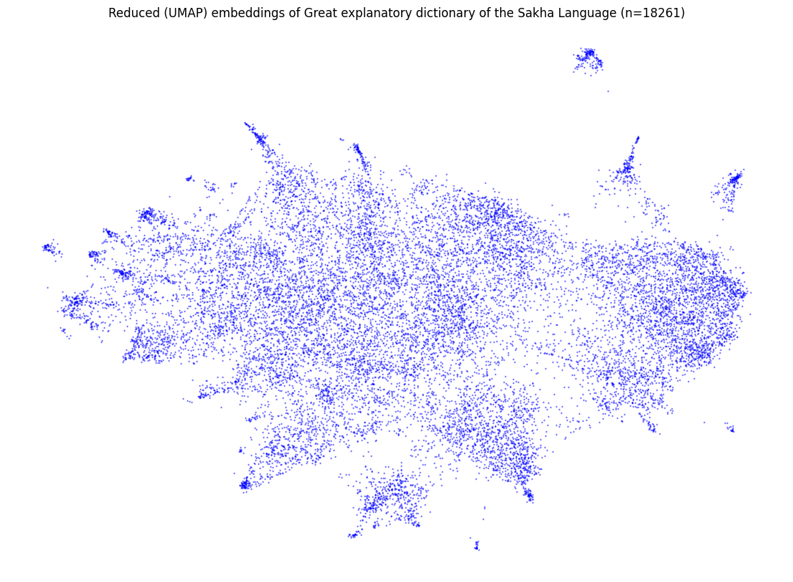

# sakha-nlp
Various tools and data for Sakha language NLP.\
\
**NB**: I'm not a linguist or NLP engineer. This is just a small open-source pet project I'm working on to benefit my native language. I would welcome any comments and suggestions. Thanks :)\
\
Already available:

* A Sakha words [dataset](https://github.com/ogpetrov/sakha-nlp/blob/main/data/btsja_parsed_v01.csv) from the GEDSL (Great Explanatory Dictionary of the Sakha Language, [link](https://igi.ysn.ru/btsja/)) with parts of speech, variants, homonyms, and (most useful, I suppose) Russian translations (n=18261). Also included is a [parser](https://github.com/ogpetrov/sakha-nlp/blob/main/data/btsja_src/btsja_parser.py) for the source GEDSL HTML page.\
(visualization of Russian translations embeddings made with [SBERT](https://github.com/UKPLab/sentence-transformers) and reduced with [UMAP](https://github.com/lmcinnes/umap))
 \
* A simple [phonemizer](https://github.com/ogpetrov/sakha-nlp/blob/main/code/phonetics/sakha_phonemizer.py) (phonemic analysis tool) for the Sakha language. It uses [n-grams](https://en.wikipedia.org/wiki/N-gram) and Sakha phonetic rules (phonotactics) to convert Sakha text (in official Cyrillic orthography) to phonemes - either IPA or V/C (vowel/consonant).
* A [brief historical overview of the Novgorodov alphabet](https://github.com/ogpetrov/sakha-nlp/blob/main/info/novgorodov_histreview/novgorodov_histreview.md) (which has become popular lately among Sakha-speaking people), in Russian.

Planned for the future:

* Expand the phonemizer for comprehensive phonetic analysis and to check phonotactics rules (i.e., spell-checking for strict Sakha language rules).
* Improve the parser to extract all information from GEDSL. At the moment, it can only parse single words without phrases and word combinations (more than 5k records) and cannot handle the remaining unstructured patterns (approximately 4-5k records).
