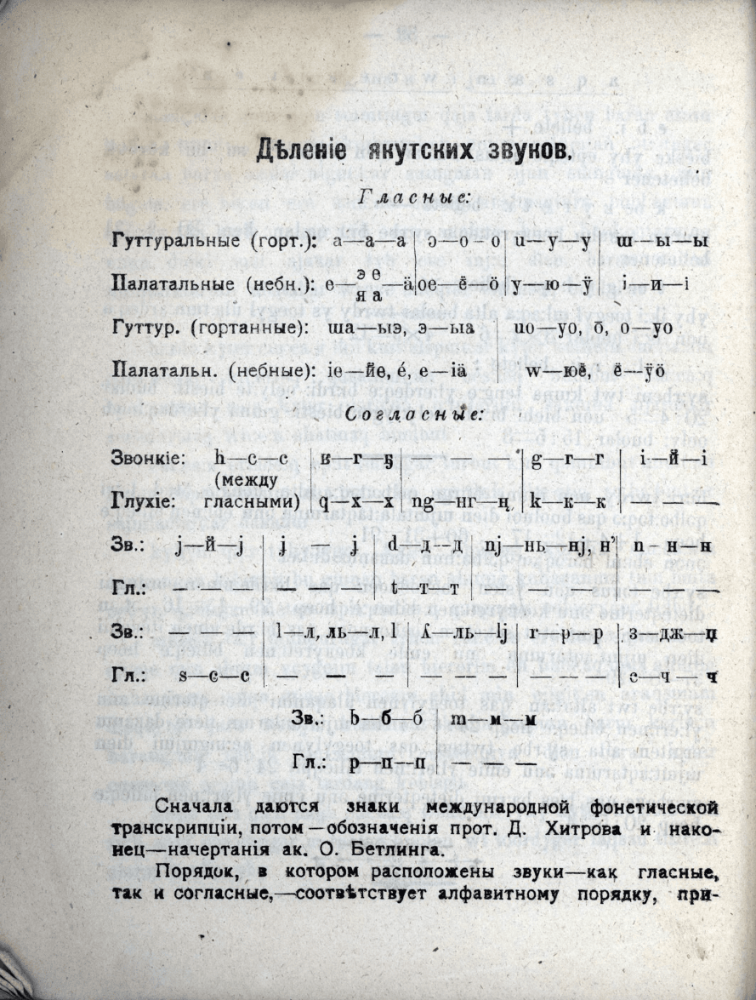
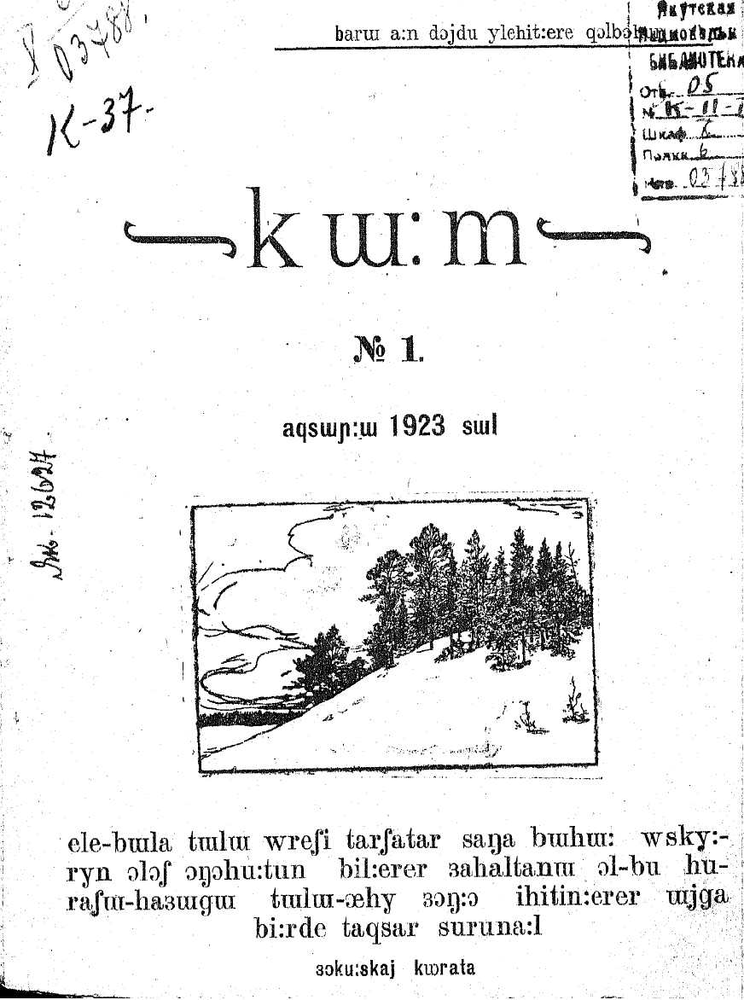
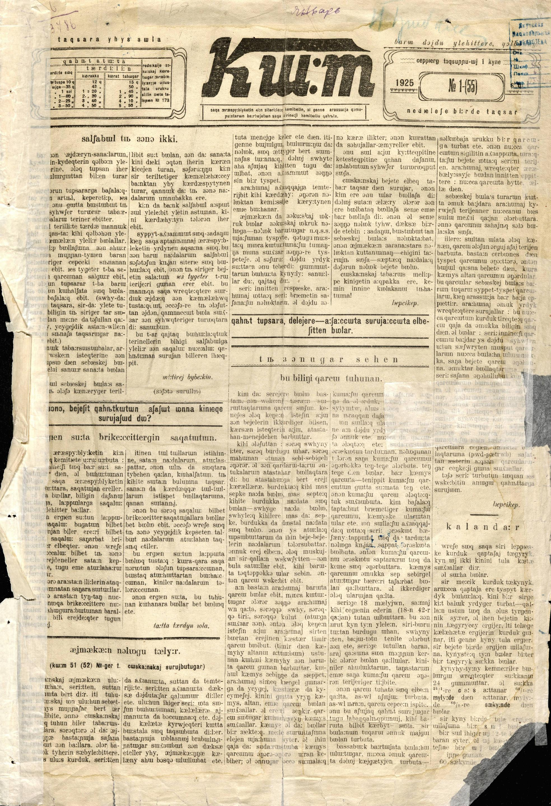
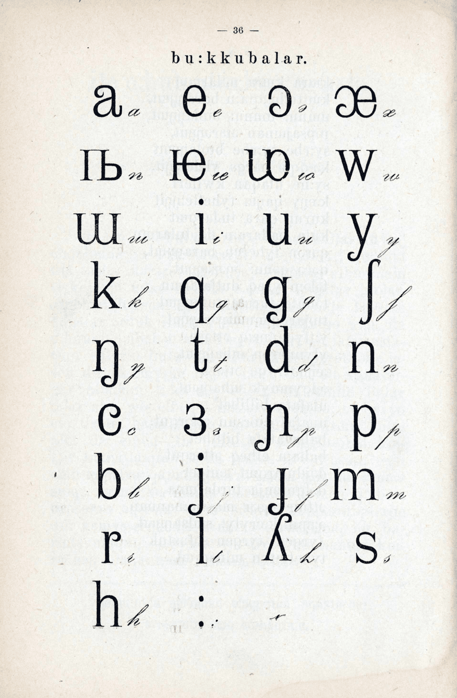
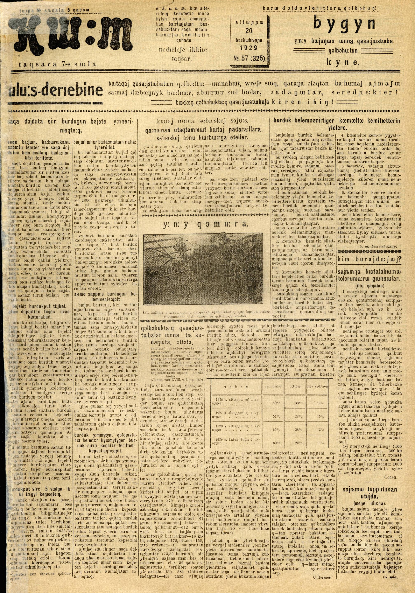
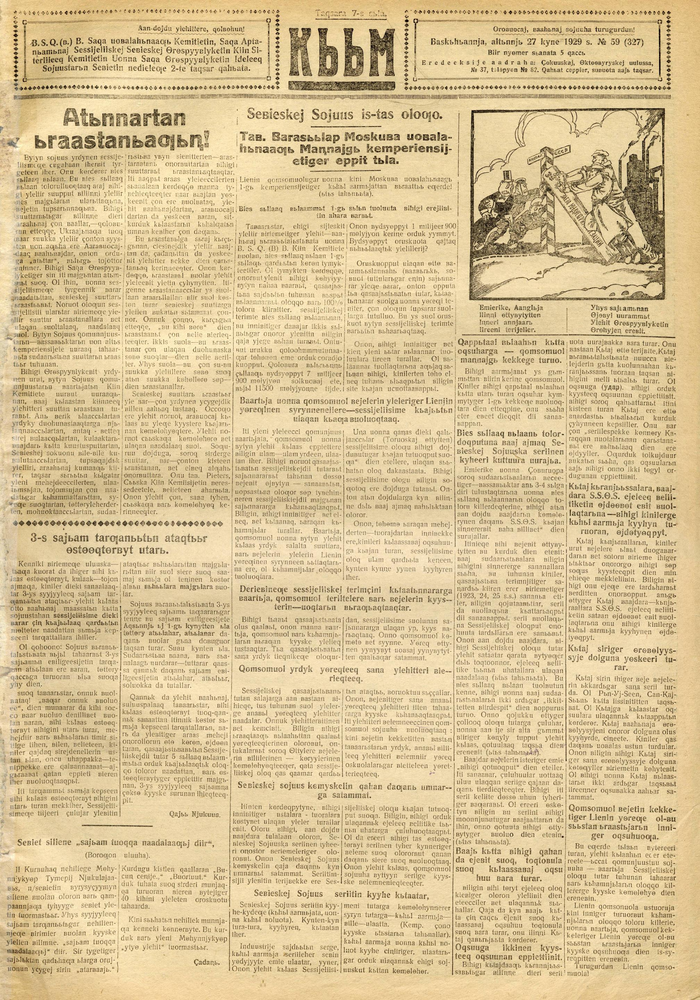

# Исторический обзор алфавита Новгородова

В истории развития алфавита Новгородова можно выделить три этапа: до создания специальных типографских литер; после создания специальных типографских литер (при жизни Н.); после смерти Новгородова.

 

Первый этап развития алфавита начинается в 1917 году, после выпуска книги saqalɯ suruk bicik (Сахалыы сурук-бичик). Семен Новгородов, во время обучения в Петроградском университете, познакомился с Международным фонетическим алфавитом (МФА), который хотел приспособить к якутскому языку. Так как в то время отсутствовали типографские литеры для МФА, Новгородов использовал литеры, которые уже были в наличии. Таким образом, от основного правила «одна фонема – одна буква» Новгородову пришлось отказаться – были введены диграфы.

 

Особые литеры для якутского алфавита Новгородова, основанного на МФА, были отлиты в 1923 году. Первым произведением, выпущенным с использованием особых символов, предусмотренными самим Новгородовым, стала газета kɯ:m (Кыым) от декабря 1923 года. Данный вариант алфавита полностью соответствует задумкам Новгородова, но не полностью совпадает с Международным фонетическим алфавитом. Орфография – ультрафонетическая, пунктуация – только конец предложения (косая черта) и скобки. Заглавные буквы отсутствуют полностью – для выделения используется полужирное начертание.

 

Почти сразу же после смерти Семена Новгородова в феврале 1925 года, в мае-июне 1925 года была проведена реформа якутского алфавита – изменения касались и орфографии, и пунктуации, однако из-за отсутствия новых типографских литер, многие пункты реформы не были выполнены – например, введение прописных букв (которые планировалось писать увеличенными строчными буквами) и изменения формы некоторых букв. Из исполненных пунктов реформы главными является написание удвоенных согласных двумя буквами (вместо такого же знака, как и для удвоения гласных) и введение пунктуации, аналогичной с европейскими языками. 

 

На изображении представлен набор букв, которые использовались начиная с 1923 года. Под типографским вариантом букв прописан также вариант для рукописного письма. Так как данная страница была взята из букваря для взрослых saŋa ɔlɔq (Саҥа олох) от 1927 года, в ней уже использовалась другая орфография (например, написание удвоенных согласных двумя буквами). Этот набор букв использовался с 1923 года до самого конца использования алфавита.  

 

На изображении можно видеть последний выпуск газеты Кыым от 20 октября 1929 года, в которой использовался алфавит Новгородова. Все изменения, которые были частично исполнены в 1925 году после реформ, сохранились в своем исполнении – новых литер (в том числе прописных букв) к этому времени отлито не было.

 

На изображении показан первый выпуск Кыым от 27 октября 1929 года, в котором используется якутский алфавит, приближенный к Новому тюркскому алфавиту (яналифу). Газета Кыым продолжает выходить до сих пор, и за это время она успела перейти на кириллицу и пережить создание систематизированной якутской орфографии.

# Список использованных источников
* Сахалыы сурук-бичик (1917) - https://e.nlrs.ru/open/9929
* Газеты электронной библиотеки РС(Я) - https://e.nlrs.ru/collections/48
* Саҥа олох: улахан дьон үөрэнэр буукубаардара (1927) - https://e.nlrs.ru/open/35977
